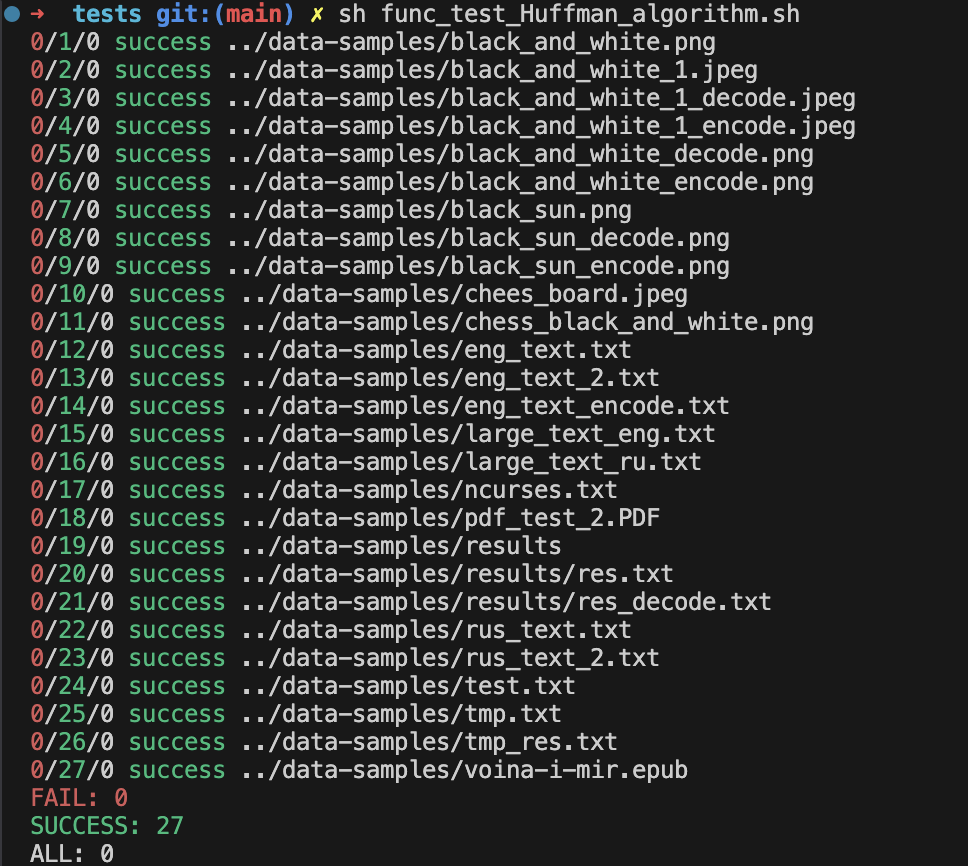

# Compressions algorithms

This project is a realization of Huffman's Algorithm in pure C. The program available to compress different type of file.

## Usage

```
Usage: compress [-a(algorithm) huff] [-e(encode)|-d(decode)] [-i(input) file_input] [-o(output) file_output]
```




## Requirements

- GCC compiler

## How to Build and Run

1. Install the necessary dependencies, including a C++ compiler and the Qt framework.
2. Clone the repository using the command:
   ```
   git clone https://github.com/sanddony/Calculator
   ```
3. Navigate to the project directory:
   ```
   cd Compressions-algorithms
   ```
4. Build the project using make:
   ```
   make
   ```
   For run tests 
   ```
   make
   cd tests
   sh func_test_Huffman_algorithm.sh
   ```
5. Run the compress program:
   ```
   ./build/compress [-a(algorithm) huff] [-e(encode)|-d(decode)] [-i(input) file_input] [-o(output) file_output]
   ```
